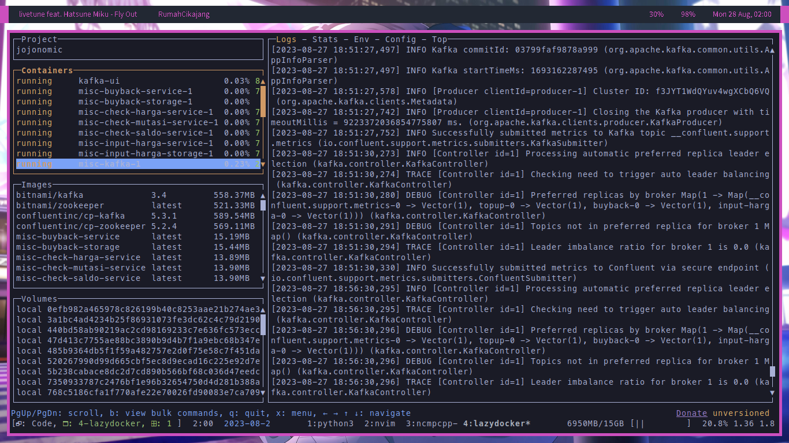
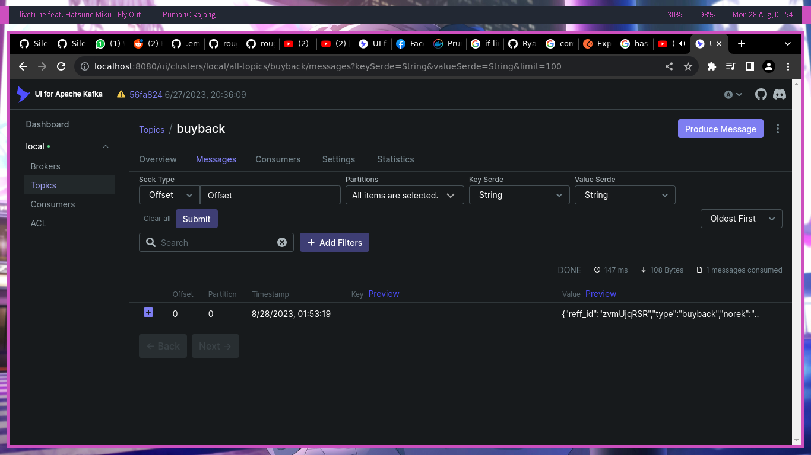
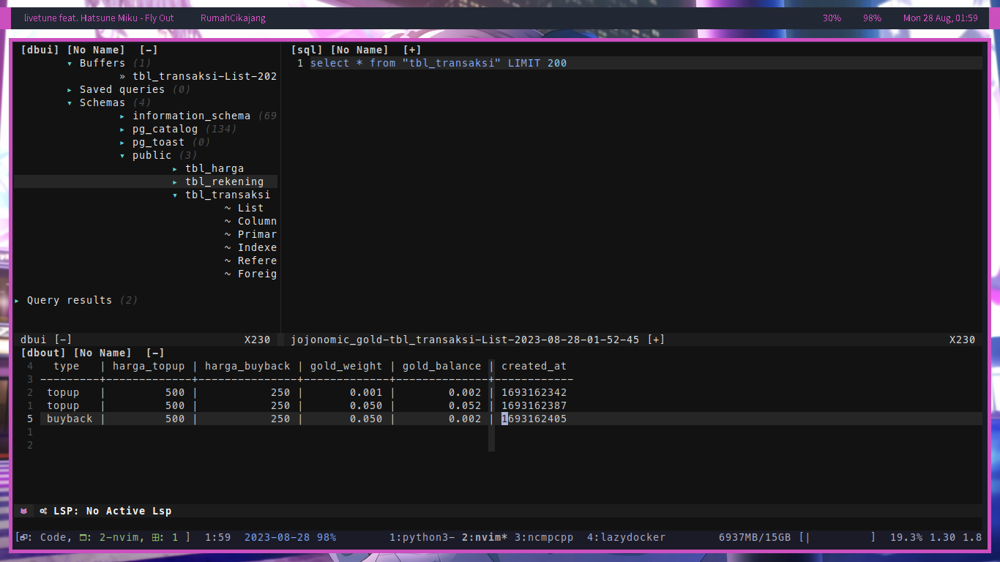

# JOJONOMIC BACKEND TEST

# How to install

**REQUIREMENTS**

- Docker
- Docker Compose
- UNIX Base computer (Not tested (yet) in Windows)

1. Clone this repo
```sh
git clone https://github.com/RyaWcksn/jojonomic-backend

cd jojonomic-backend
```

2. Start all services (Including Kafka, Postgres, and Kafka-UI)

Build all service, each service's ENVs already specified at `docker-compose.yml` environment parameter

```sh
docker compose -f ./misc/docker-compose.yml up -d --build 
```

3. Test

Postman collection in

```sh
./misc/JOJONOMIC.json
```

4. Individual services

You can start service individually by going to the specific folders and then

```sh
go run cmd/main.go
```

Edit the `.env` file first 


# Notes

## Containerization

I'm using multi stage build for lightweight docker container size

## Service structure

I'm using Depedency Injection and Hexagonal pattern for easy unit test

## Date time

I'm using Unix Epoch time for more easy configuration for each timezone

Reference := [Youtube - Programmer Zaman Now](https://www.youtube.com/watch?v=nEOEvWm5yPA&t), Credit to mas Eko Kurniawan

# Screenshots

**KAFKA**



**KAFKA-UI**



**POSTGRES**


